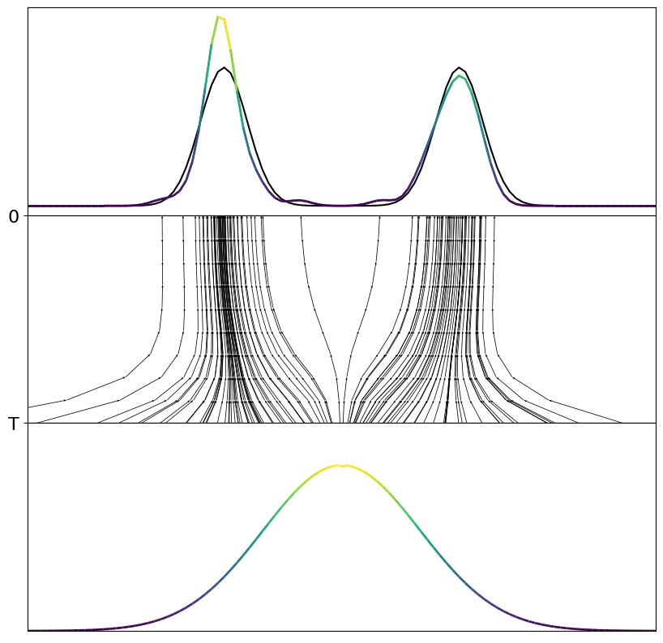
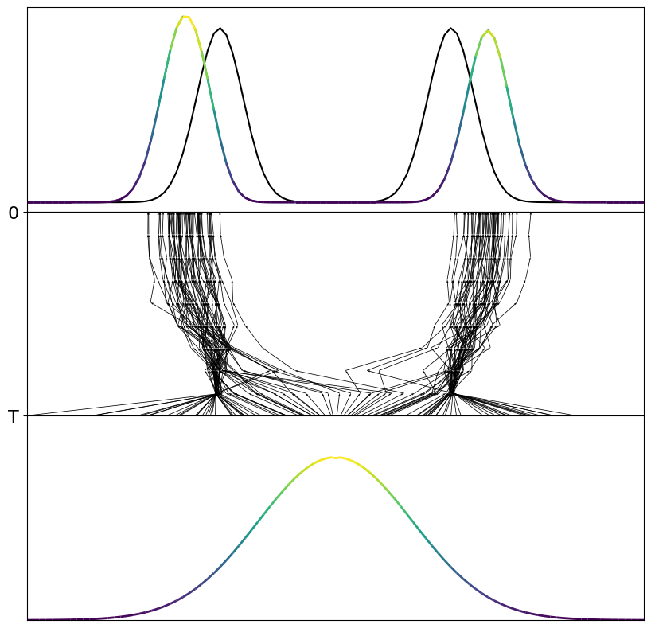
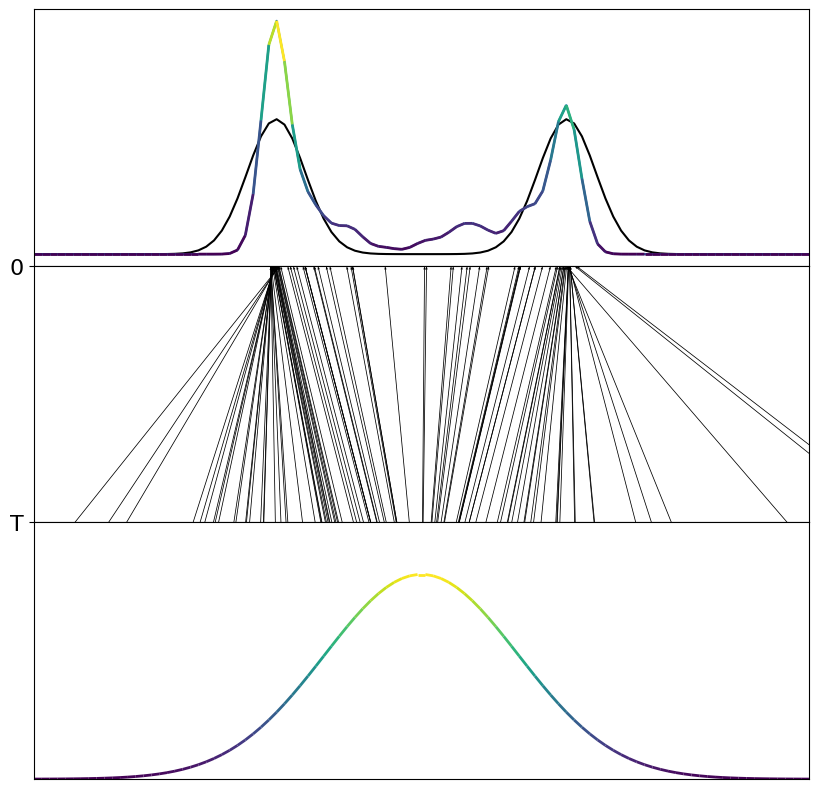
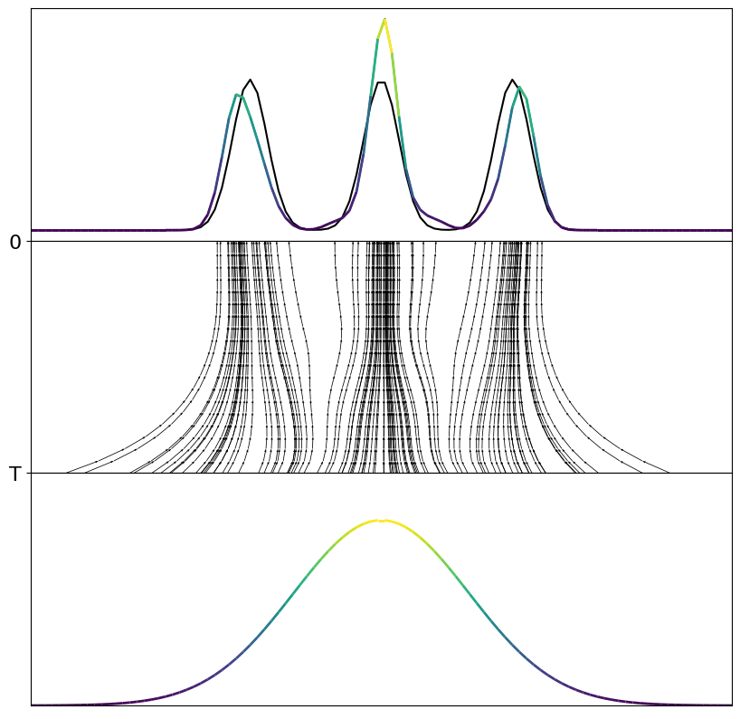
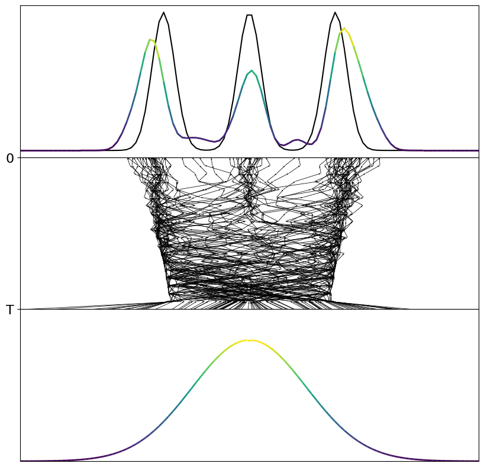

# Consistency Models 1D Toy Tasks
Minimal unofficial implementation of consistency models (CM) proposed by Song et al. 2023 on 1D toy tasks.

---

### Installation

```bash

pip install -e .

```

### Consistency Model Training

Right now, the continuous time and discrete consistency training (CT) are implemented to train these models without the help of a teacher diffusion model. However, experiments on the toy task already show, that using a diffusion training objective before starting the CT help to stabilize the training process significantly. 

To try it out:

- Discrete Consisteny Training: ```cm_main.py```

- Continuous Consisteny Training: ```ct_cm_main.py```


*Data*

I have implemented some simple 1D toy tasks to try out the capabilities of multimodality and expressiveness of consistency models. Just change the input string for the datamanager class to one of the following datasets ```'three_gmm_1D', 'uneven_two_gmm_1D', 'two_gmm_1D', 'single_gaussian_1D'```.

---

### Visualization of the Results

After the training results of the trained model will be plottted. The plots look like the example ones below. 

### Some results 

I used 2000 training steps for these results with diffusion pretraining. 

*Two Gaussians*

<div style="display:flex">
  
  
  
</div>
<p style="text-align:center">From left to right: EDM Diffusion pretraining with Euler, Multistep prediction with Consisteny Models and Single Step prediction.</p>

*Three Gaussians*
<div style="display:flex">
  
  
  
</div>
<p style="text-align:center">From left to right: EDM Diffusion pretraining with Euler, Multistep prediction with Consisteny Models and Single Step prediction.</p>

--- 

### Lessons learned

- Consistency training is not really stable, which is not surprising, since the authors also discuss its shortcomings in the paper and even recommend to use pretrained diffusion models as initialization for the training

- Image hyperparamters do not translate well to other domains. I hat limited sucess with the recommened parameters for Cifar10 and other image-based applications. By significanlty reducing the maximimum noise level results improved. I also increased the minimum number of discrete noise levels and the maximum. 

- Multistep prediction of consistency models has a certain drift towards to outside, which I cannot explain. I just used linear noise scheduler for the multistep sampling, so maybe with better discretization results will improve

- Discrete training works a lot better than the continuous version. The authors report similar observations for the high-dimensional image domain. 


### To Dos

 - [ ] Implement Consistency Distillation Training
 - [ ] Add new toy tasks
 - [ ] Check conditional training 
 - [ ] Find good hyperaparmeters
 - [ ] Improve plotting method 


--- 

### Acknowledgement

- the general consistency class is based on the code from OpenAI's [consistency models repo](https://github.com/openai/consistency_models)

- some sampling methods and other functions are from [k_diffusion](https://github.com/crowsonkb/k-diffusion)

- the model is based on the paper [Consistency Models](https://arxiv.org/pdf/2303.01469.pdf)

### Citation


```bibtex
@article{song2023consistency,
  title={Consistency Models},
  author={Song, Yang and Dhariwal, Prafulla and Chen, Mark and Sutskever, Ilya},
  journal={arXiv preprint arXiv:2303.01469},
  year={2023},
}
```

---